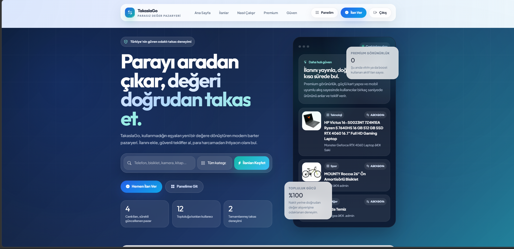
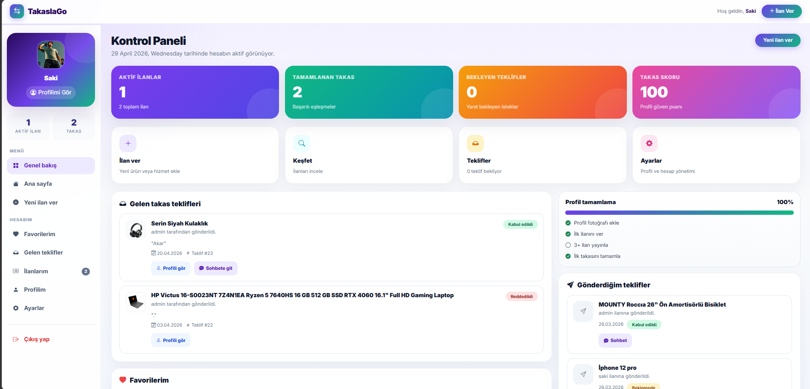
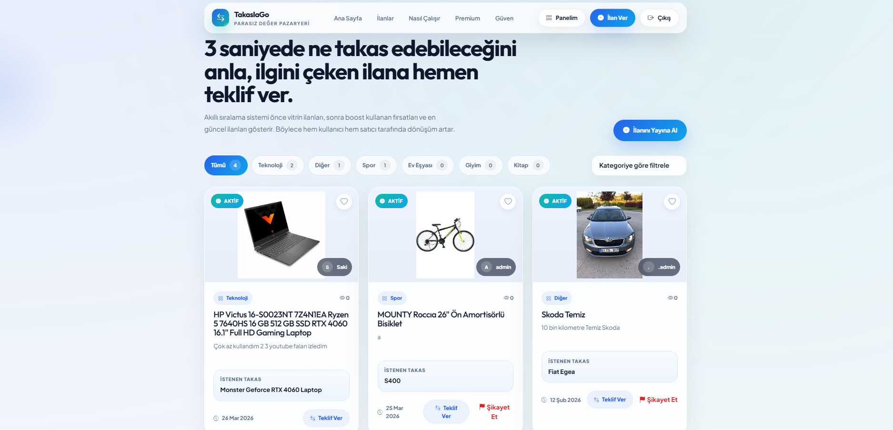
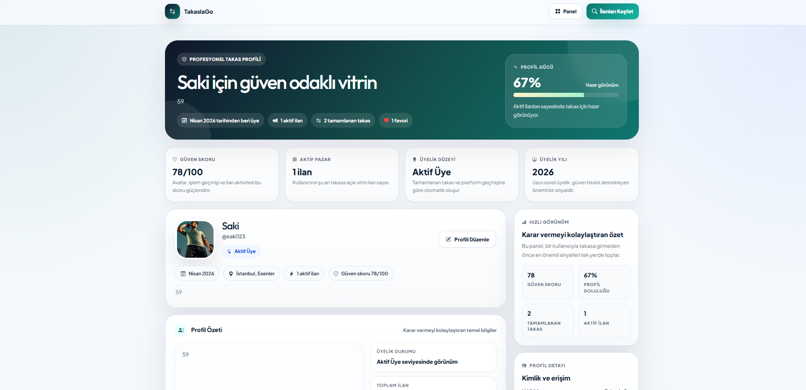

# 🔄 TakaslaGo - Modern Takas Platformu

TakaslaGo, kullanıcıların eşyalarını güvenli ve hızlı bir şekilde takas etmelerini sağlayan tam donanımlı bir web platformudur.

## 🚀 Öne Çıkan Özellikler
* 📱 **Gelişmiş Profil Sistemi:** Sade ve kullanışlı kullanıcı profilleri.
* 💬 **Real-time Mesajlaşma:** Kullanıcılar arası anlık sohbet ve dosya/fotoğraf paylaşımı.
* 🛡️ **Güvenlik:** Kullanıcı raporlama ve moderasyon araçları.
* 📸 **İlan Yönetimi:** Kolay ilan verme ve interaktif takas teklifleri.

## 🛠️ Kullanılan Teknolojiler
* **Backend:** PHP
* **Frontend:** JavaScript, CSS, HTML
* **Database:** MySQL

---
> ⚠️ **Not:** Bu depo sadece projenin tanıtımı ve özellikleri hakkında bilgi vermek amacıyla oluşturulmuştur. Güvenlik ve telif hakları nedeniyle kaynak kodları paylaşıma kapalıdır.

## 📸 Proje Ekran Görüntüleri

### Ana Sayfa

### Kullanıcı Paneli ve İlanlar

### Profil Sayfası

